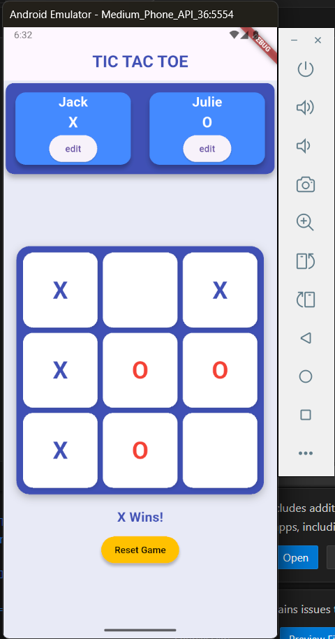
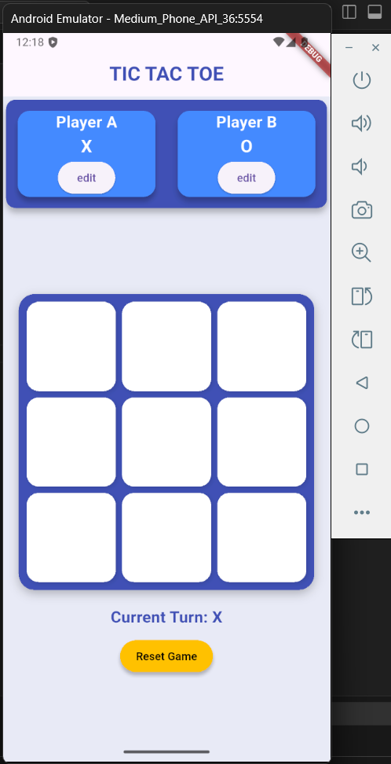

# 🎮 Flutter Tic Tac Toe Game

A clean and responsive **Tic Tac Toe** game built using **Flutter**. Includes player name editing, alternating turns, win/draw detection, and a beautiful UI using Cards and modern layout styling.

---

## ✨ Features

- 🔁 Two-player turn-based gameplay
- ✏️ Editable player names with symbol indicators (X & O)
- 🧠 Game logic with win and draw detection
- 🎨 Clean UI using `Card`, `GridView`, and consistent blue theme
- 🔄 Reset functionality to restart the game
- ✅ Responsive layout with centered board

---

## 📸 UI Preview

| Player Panel | Game Board |
|--------------|-------------|
|  |  |


---

## 🚀 Getting Started

### 1. Clone the Repository

```bash
git clone https://github.com/neha-maurya-28/Tic-Tac-Toe.git
cd flutter-tic-tac-toe
```

### 2. Run the App
Make sure you have Flutter installed. Then run:
```bash
flutter pub get
flutter run
```

## 📦 Dependencies
Only Flutter core libraries used:
  - material.dart
    
No external packages required.
